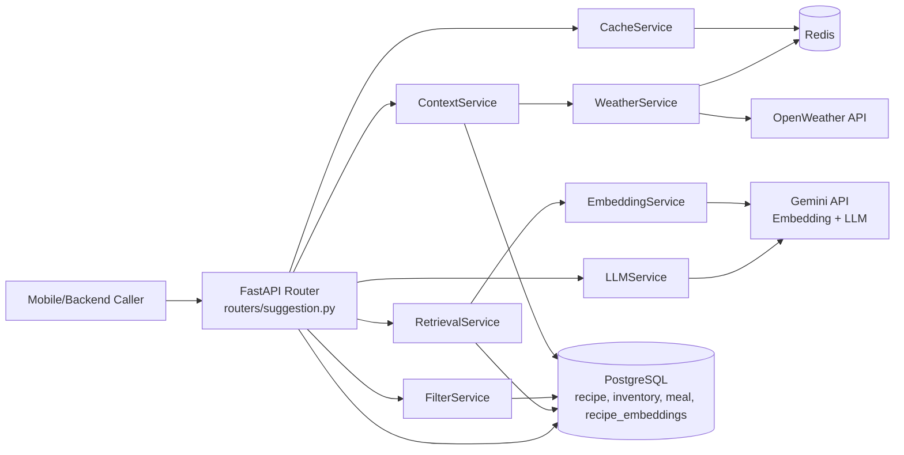
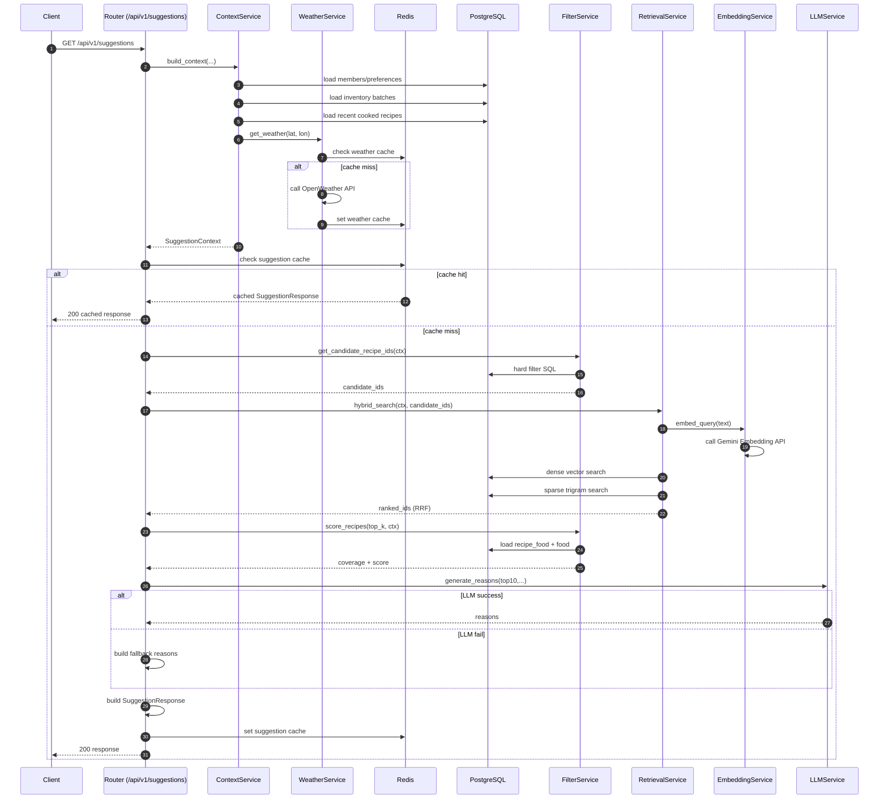
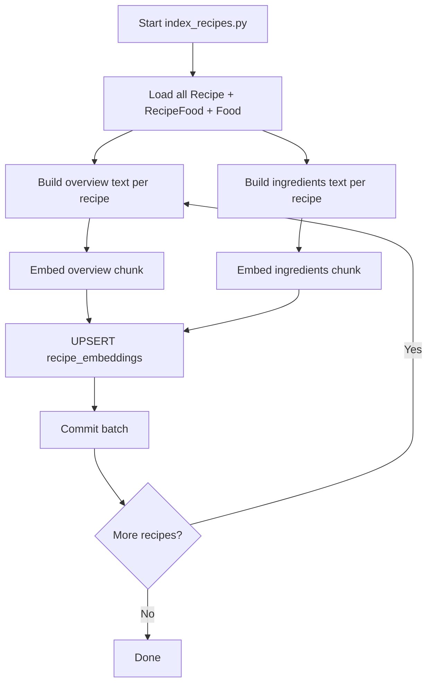

# AI Service (Smart Food Suggestion)

## 1) Mục tiêu của service

`ai_service` là FastAPI service chịu trách nhiệm gợi ý món ăn thông minh dựa trên:
- tồn kho thực phẩm hiện tại của hộ gia đình,
- nguyên liệu sắp hết hạn,
- lịch sử món đã nấu gần đây,
- dị ứng/chế độ ăn/khẩu vị của các thành viên,
- ngữ cảnh thời tiết,
- và phần diễn giải ngôn ngữ tự nhiên từ LLM (Gemini).

Service này không tự quyết định business của backend chính (meal/inventory/auth), mà đọc dữ liệu từ PostgreSQL và trả về danh sách gợi ý đã xếp hạng.

---

## 2) Cấu trúc thư mục

```text
ai_service/
├── main.py
├── config.py
├── dependencies.py
├── Dockerfile
├── requirements.txt
├── models/
│   ├── database.py
│   ├── orm_models.py
│   └── schema_additions.sql
├── routers/
│   └── suggestion.py
├── schemas/
│   └── suggestion_schema.py
├── services/
│   ├── cache_service.py
│   ├── context_service.py
│   ├── embedding_service.py
│   ├── filter_service.py
│   ├── retrieval_service.py
│   ├── llm_service.py
│   └── weather_service.py
└── scripts/
    └── index_recipes.py
```

---

## 3) Kiến trúc tổng thể

- **API Layer (`routers/suggestion.py`)**
  - Nhận request, điều phối pipeline, trả response.
- **Context Layer (`services/context_service.py`)**
  - Tổng hợp ngữ cảnh hộ gia đình và thời tiết thành `SuggestionContext`.
- **Filter + Scoring Layer (`services/filter_service.py`)**
  - Hard filter bằng SQL, soft scoring theo coverage + expiring bonus + weather boost.
- **Retrieval Layer (`services/retrieval_service.py`)**
  - Hybrid search (dense vector + sparse trigram), hợp nhất bằng RRF.
- **LLM Layer (`services/llm_service.py`)**
  - Sinh `reason/highlight` cho top món.
  - Nếu LLM lỗi: fallback deterministic reason (đã triển khai).
- **Caching Layer (`services/cache_service.py`, `services/weather_service.py`)**
  - Cache gợi ý và cache thời tiết qua Redis.
- **Data Layer (`models/*.py`)**
  - SQLAlchemy async models + pgvector schema mở rộng.

### Mermaid: Component Architecture



---

## 4) Luồng hoạt động chính: `/api/v1/suggestions`

File điều phối chính: `routers/suggestion.py`.

1. **Build context**
   - `ContextService.build_context(...)`:
     - load thành viên + preference,
     - load inventory batch khả dụng,
     - load recent recipes đã nấu,
     - gọi weather (có cache).
2. **Check cache gợi ý**
   - `CacheService.build_suggestion_cache_key(...)` và `get_suggestion_cache(...)`.
3. **Hard filter (SQL)**
   - Loại món đã nấu gần đây,
   - loại món chứa dị ứng của bất kỳ thành viên,
   - lọc theo meal_type + max_cook_minutes.
4. **Hybrid retrieval**
   - Dense search từ embedding vector (`recipe_embeddings.embedding`),
   - sparse search từ trigram (`chunk_content`),
   - fusion bằng Reciprocal Rank Fusion.
5. **Soft scoring**
   - coverage ratio theo tồn kho,
   - bonus nguyên liệu sắp hết hạn,
   - weather boost nhẹ.
6. **Chọn top**
   - top 5 fully covered,
   - top 5 partially covered.
7. **Sinh lý do bằng LLM**
   - `LLMService.generate_reasons(top_10, ...)`.
   - Nếu lỗi LLM: dùng fallback reason deterministic để không fail API.
8. **Build response + cache**
   - `_build_response(...)` và `set_suggestion_cache(...)`.

### Mermaid: Detailed Sequence (Suggestion Pipeline)



---

## 5) Các API endpoint

### 5.1 `GET /api/v1/suggestions`
- Trả top gợi ý theo ngữ cảnh hộ gia đình.
- Query params:
  - `household_id` (int)
  - `meal_type` (`breakfast|lunch|dinner|snack`)
  - `lat`, `lon` (float)
  - `max_cook_minutes` (optional)
- Output: `SuggestionResponse`
  - `fully_covered`, `partially_covered`, `weather_context`, `generated_at`

### 5.2 `GET /api/v1/recipes/all-catalog`
- Trả toàn bộ catalog recipe đã score và chia fully/partially.
- Không gọi LLM (reason/hightlight rỗng).

### 5.3 `GET /api/v1/recipes/search`
- Search recipe theo tên món hoặc tên nguyên liệu.
- Có xử lý overlap dị ứng và warning.
- Nếu truyền `meal_id`, loại user đã decline attendance khỏi tập tính dị ứng.

### 5.4 `GET /api/v1/recipes/by-tag`
- Search recipe theo tag (`cuisine`, `difficulty`, `meal_type`) + query bổ sung.

### 5.5 `GET /health`
- Healthcheck cơ bản cho container/orchestrator.

---

## 6) Ý nghĩa các service cốt lõi

### `ContextService`
- Chuẩn hóa dữ liệu domain rời rạc thành một object `SuggestionContext` duy nhất.
- Hợp nhất sở thích/dị ứng theo nguyên tắc an toàn (union).

### `FilterService`
- Hard filter giúp tiết kiệm retrieval cost và tránh trả món vi phạm ràng buộc cứng.
- Soft scoring giữ linh hoạt ranking thay vì loại bỏ quá sớm.

### `RetrievalService`
- Dùng hybrid dense+sparse để cân bằng semantic match và keyword match.
- RRF giúp ghép 2 ranking không cần ép về cùng thang điểm.

### `LLMService`
- Chỉ thực hiện NLG (reason/highlight), không tham gia quyết định score.
- Tách vai trò giúp hệ thống ổn định ngay cả khi LLM lỗi.

### `CacheService`
- Giảm latency và giảm chi phí gọi LLM/embedding/weather.
- Key hash dựa trên ngữ cảnh có ảnh hưởng đến kết quả.

### `WeatherService`
- Có cache theo lat/lon đã làm tròn để tăng hit rate.
- Chuẩn hóa về `season_hint` để phục vụ scoring.

---

## 7) Dữ liệu và schema mở rộng AI

`models/schema_additions.sql` thực hiện:
- bật extension: `vector`, `pg_trgm`.
- thêm cột AI cho `recipe` (`cuisine_type`, `season_tags`, `meal_type_tags`, ...).
- tạo bảng `recipe_embeddings` (2 chunk mỗi recipe: `overview`, `ingredients`).
- tạo index trigram + index recipe_id.

Mục tiêu: triển khai retrieval trực tiếp trên PostgreSQL, không cần vector DB riêng.

---

## 8) Luồng indexing embeddings

Script: `scripts/index_recipes.py`

- Load toàn bộ recipe + ingredient names.
- Tạo 2 chunk text/recipe:
  - `overview`: semantic summary,
  - `ingredients`: keyword-focused.
- Gọi Gemini Embedding API với `task_type=RETRIEVAL_DOCUMENT`.
- Upsert vào `recipe_embeddings` bằng `(recipe_id, chunk_type)`.

### Mermaid: Indexing Pipeline



---

## 9) Cơ chế xử lý lỗi quan trọng

- **LLM fail-safe trong suggestions**
  - Khi `generate_reasons` lỗi (timeout, parse JSON lỗi, upstream lỗi), API không trả 500.
  - Service fallback sang deterministic reasons để vẫn trả response hợp lệ.
- **Cache parse lỗi**
  - Nếu Redis chứa payload không hợp lệ theo schema, service tự xóa key lỗi.
- **Weather/network lỗi**
  - `httpx.raise_for_status()` sẽ ném exception; caller có thể xử lý theo policy vận hành.

---

## 10) Biến môi trường chính

Tham chiếu `config.py`:

- `GEMINI_API_KEY`
- `EMBEDDING_MODEL` (default: `models/gemini-embedding-001`)
- `LLM_MODEL` (default: `gemini-2.5-flash`)
- `EMBEDDING_DIMENSION` (default: `3072`)
- `DATABASE_URL`
- `REDIS_URL`
- `OPENWEATHER_API_KEY`
- `AI_SERVICE_PORT` (default: `8001`)
- `TOP_K_RETRIEVAL` (default: `20`)
- `WEATHER_CACHE_TTL_SECONDS` (default: `1800`)
- `SUGGESTION_CACHE_TTL_SECONDS` (default: `7200`)
- `EXPIRING_THRESHOLD_DAYS` (default: `3`)

---

## 11) Chạy service

### Cách 1: Docker

Trong root project, service được build từ `ai_service/Dockerfile` và chạy bằng `docker-compose.yml`.

### Cách 2: Local

```bash
cd ai_service
python -m venv .venv
source .venv/bin/activate
pip install -r requirements.txt
uvicorn ai_service.main:app --host 0.0.0.0 --port 8001 --reload
```

---

## 12) Ghi chú thiết kế

- Pipeline được thiết kế theo thứ tự cố định để cân bằng latency, cost, quality.
- Quyết định gợi ý chính nằm ở filter/retrieval/scoring; LLM chỉ là lớp diễn giải.
- Kiến trúc phù hợp cho quy mô vừa (dataset recipe trung bình), dễ vận hành trong monorepo hiện tại.
